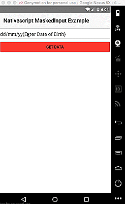

# nativescript-maskedinput-example

<h2 id="Usage">How to Use</h2>

This app is built with the NativeScript CLI. Once you have the [CLI installed](https://docs.nativescript.org/start/quick-setup), start by cloning the repo:

```
$ git clone https://github.com/dlucidone/nativescript-maskedinput-example.git
$ cd nativescript-maskedinput-example
```

And the same command to run Groceries on Android:

```
$ tns run android
```

<h2 id="Usage">Demo run</h2>



<h2 id="thanks">Thanks to - </h2>

 The following project uses nativescript-maskedinput plugin https://github.com/bthurlow/nativescript-maskedinput
